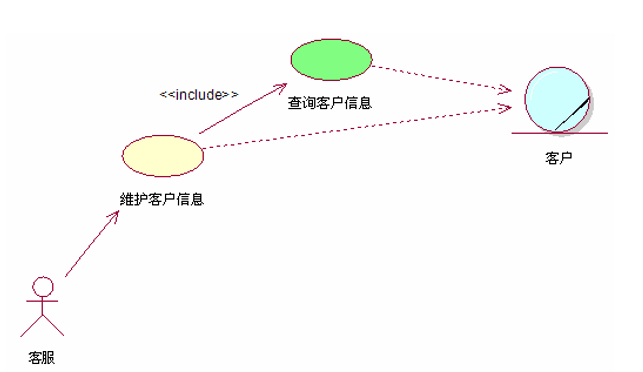

# 客户管理

### 业务背景
系统需要记录客户的相关信息，并可维护。

### 功能介绍
客户的信息操作作为项目的基本功能之一，为后期的模块做铺垫，功能包括客户信息的录入，编辑，查看，删除。

### 功能实现
##### 1.录入信息
由客服录入客户的客户编号，身份证编号，客户性质，单位名称，座机，移动电话，客户地址，邮编，联系人，电子邮件等信息 ，
客户的送机时间由系统自动生成。

##### 2.编辑信息
根据录入用户的客户编号与数据库中的编号匹配，可修改客户的全部或个别信息。

##### 3.查看信息
根据客户的身份证编号来与数据库中的编号查找客户的信息并打印出来，也可将信息全部打印。

##### 4.删除信息
根据客户的编号来删除客户信息。

